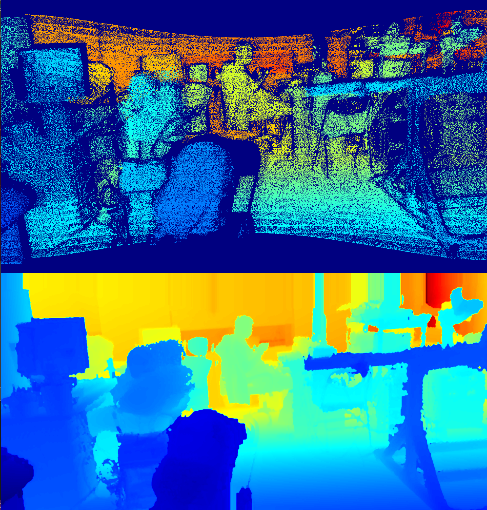

# 深度图补全
## 一、运行环境与依赖
* 运行环境
WINDOWS、UBUNTU

* 依赖
OpenCV

## 二、使用方法
```
git clone xxx
cd && mkdir build
cd build
cmake ..
make
./demo
```

## 三、介绍
深度图补全(depth image completion)也称为深度图修复(depth image inpainting)旨在将一张有空洞的、未定义深度像素的深度图补全，获得稠密的深度图。

本仓库参考论文[1]利用形态学和滤波算子对基于激光雷达重投影获得的稀疏深度图进行补全。效果如下

<p align="center"></p>
<h6 align="center">原始稀疏深度图(上)、修复后的稠密深度图(下)</h6>

## 四、参考资料
[1] Ku J , Harakeh A , Waslander S L . In Defense of Classical Image Processing: Fast Depth Completion on the CPU[C]// 2018 15th Conference on Computer and Robot Vision (CRV). IEEE, 2018.

[2] [论文[1] github代码](https://github.com/kujason/ip_basic)

[3] [OpenCV CV_32FC1格式保存](https://stackoverflow.com/questions/32332920/efficiently-load-a-large-mat-into-memory-in-opencv/32357875#32357875)
